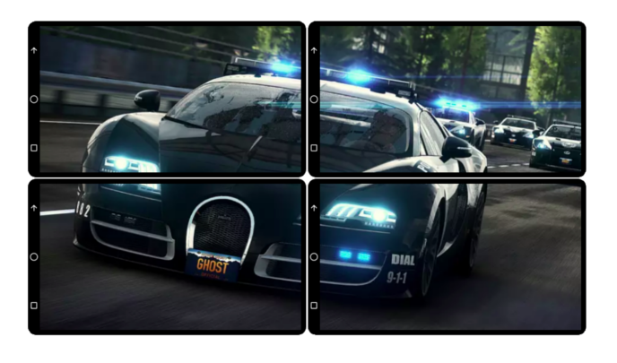

## BicastR 

> Split and view large media (image or video) on multiple displays  

[Concept Demo](https://ankurparihar.github.io/projects/BicastR)

### About
- This is distributed media (image, video) player.
- Large media is split to multiple displays/browser windows, which put together side-by-side recreates the media
- Device/Window is called endpoint
- You will see the entire setup as a single screen instead of multiple windows/devices

### Properties
- Image can be dragged
- Video can be play/pause/seek but can not be dragged
- Endpoint at position 0:0 is master endpoint
- In case of image, all endpoints supports image dragging
- In case of video, all endpoints supports video interactions but only master endpoint can play audio

### Instructions

#### Server setup
- Install webpack `npm install webpack`
- [Optional] change port address (_websocketPort_) in [server.js](./server.js)
- Run server `node server.js`

#### Setup using one device
- Open multiple browser windows
- All windows should be of same size and put side-by-side in 2-D grid fashion

#### Setup using multiple devices
- Connect devices to network
- All devices must be able to access the server

#### After settting up
- Visit _index.html_ on each browser window or device
- Select Image/Video mode, all windows should be either image or video, mixed configuration wouldn't work! 
- Select `row` (starts with 0) and `col` (starts with 0) and `server address` (You need to have local or remote server)
- Click button to load media
- If image, drag it and see the effects
- If video, play/pause/seek and see the effect

### Possible future work
- Proper communication protocol design
- UI design
- Media continuity - Force identical media on all endpoints
- Handling endpoints with multiple dimensions